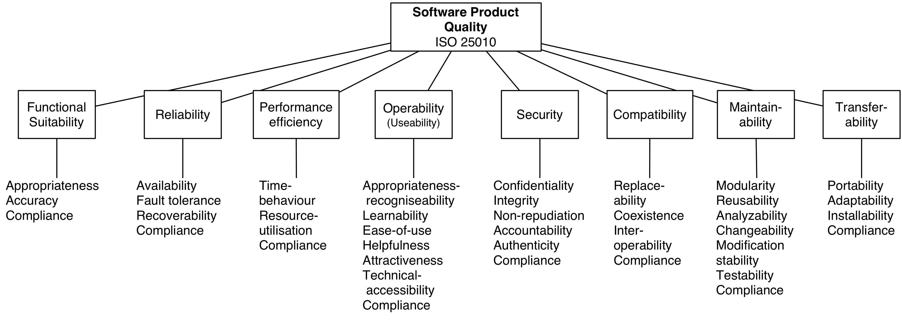

# Arc42 based documentation template

## Introduction and Goals

Documentation can be shaped in different ways, but most important is that whatever structure documentation has, it is standardized across the company.

To keep the technical products, platform and architecture documentation familiar, it should be based on a common standard.
[Arc42](https://arc42.org/) standard is an industry recognized documentation template for architecture and other types of technical documentation.

Arc42 was originally designed as architectural documentation, but it can be easily adapted to devops or platform documentation as well.

Main goal is to provide a clear and conscience documentation framework and processes that will streamline ans simplify documentation creation and maintenance process.

Why is software documentation important? Good documentation plays critical role in following scenarios:

- Onboarding of new team members. Every time someone joins the team, good documentation will help in fast orientation and will not require extensive time investment from other team members to teach good fundamental level of the project knowledge.

- Regulatory requirements and audit. Good documentation makes it much easier to work with auditors. Sometimes documentation is even a strict requirement for audit.

- Communication with all stakeholders. Good documentation enables all types of stakeholders to understand software in the context they are interested in. Documentation should take into consideration different types of stakeholders and carefully adjusts wording to be less or more technical, then it saves the team a lot of time otherwise spent on explaining and translating software system properties to everyone.

### (Requirements Overview)

### Quality Goals



Following quality goals are the most important for the documentation.

| Group            | Quality Goal |
| ---------------- | ------------ |
| Usability        | Ease of use  |
| Usability        | Helpfulness  |
| Maintainability  | Re-usability |
| Transfer-ability | Adaptability |

More details about quality goals and scenarios can be found in the [solution strategy](#solution-strategy) section.

### Stakeholders

| Role/Name                                   | Contact              | Expectations                                                    |
| ------------------------------------------- | -------------------- | --------------------------------------------------------------- |
| Principal Platform Engineer                 | aaron@upbound.io     | Process review                                                  |

## (Architecture Constraints)

## System Scope and Context

Let’s define desired characteristics of software documentation to fit into modern, rapid pace of development.

Documentation should have following characteristics (S.H.A.R.P)

**Simple**. Documentation should be simple and minimalists to decrease maintenance effort and make sure all stakeholders (including new developers) can understand the core concepts.

**Holistic**. Different types of documentation consumers will require different contexts. Good documentation should account for all stakeholders and make sure everyone can participate and understand. Enabling real time collaboration is another important goal.

**Automated**. In order to make sure that documentation is maintained over time and there is only minimal impact on development teams, most of the diagrams, charts and specifications should be as automated as possible. Using <https://plantuml.com> is recommended, but other diagrams-as-code tools like Mermaid are ok.

**Reusable**. Software documentation structure, vocabulary and model should be reusable for any new software projects, so having a structured but in the same time flexible documentation model is very useful.

**Portable**. It should be easy to generate and distribute documentation independently on any hosting platform.

### (Business Context)

### (Technical Context)

## Solution Strategy

The main goal is to provide fully standardized documentation process across the company with a few important guidelines:

- **DO** use [arc42](https://arc42.org/) as a documentation standard
- **DO** use arc42 templates from this repository, one [with explanations](templates/arc42-explanations-v1.md) and one with [documentation structure](templates/arc42-raw-v1.md)
- **DO** place documentation content in a README.md file in the root of a project or alternatively in a README.md file in /docs folder
- **DO** use GitHub flavored markdown can be used or AsciiDoc format
- **DO** use PlantUML proxy server to render diagrams in runtime, as GitHub is not able to render PlantUML diagrams natively
- **DO NOT** fill whole documentation at once,if some part so the documentation makes no sense or are currently under development, simply surround the paragraph with brackets ().
- **DO NOT** document every detail of the system. Only document things, facts and reasons that you or your stakeholders consider important enough to justify written documentation.
- **DO NOT** create "how to" guides. If you need to create a how to instructions for end users of your system, write them somewhere else and link in the documentation.

### Scenarios

| Quality Goal | Scenario                                                  | Details |
| ------------ | --------------------------------------------------------- | ------- |
| Ease of use  | Initial documentation creation                            |         |
| Helpfulness  | Communication and interaction with documentation audience |         |
| Re-usability | Long term maintenance and obsolescence management         |         |
| Adaptability | Long term maintenance and obsolescence management         |         |

There are 3 common scenarios for interacting with documentation that the quality goals address.

#### Initial documentation creation and adoption

Documentation can be created by copy/pasting the existing arc42 template and filling out sections when needed.

#### Communication with stakeholders

Documentation can be

- hosted on GitHub and consumed by stakeholders by reading a README.md file
- served via static web page using docsify, hugo or other static web page generator
- converted to many popular formats like _.pdf,_.docx, \*.rtf using pandoc or other mechanisms

#### Maintenance and obsolescence management

Documentation must be maintained over time. To ensure that this is possible, documentation needs to be automated with CI/CD pipelines and ease-of-use convenience tools for developers.

## C4 Diagrams: Building Block View

### C4: System Context


## Runtime View

```plantuml
@startuml documentation-sharp-components
!theme materia-outline
!define LOGOS https://raw.githubusercontent.com/plantuml-stdlib/gilbarbara-plantuml-sprites/v1.0/sprites

'Icons
!include <kubernetes/k8s-sprites-labeled-25pct>
!include <aws/Compute/AmazonECS/ECScontainer/ECScontainer>
!include <tupadr3/font-awesome-5/user>
!include <material/file_document>
!include <material/all_inclusive>
!include <material/robot>
!include <material/account_switch>
!include <material/folder_move>
!include <material/git>
!include <material/google_chrome>
!include <material/file>
!include <material/server>
!include https://raw.githubusercontent.com/Piotr1215/sprites/master/language_markdown.puml
!include LOGOS/netlify.puml
!include LOGOS/azure.puml

'Styles
skinparam BackgroundColor white
skinparam componentShadowing true
skinparam rectangleRoundCorner 0
skinparam rectangleBorderStyle default
skinparam rectangleBackgroundColor white
skinparam componentBackgroundColor white
'skinparam linetype ortho
skinparam rectangleShadowing true
skinparam ActorBackgroundColor white
skinparam ParticipantBackgroundColor transparent
skinparam CollectionsBackgroundColor transparent
skinparam FrameBackgroundColor transparent
skinparam CollectionsBorderColor blue
skinparam ComponentBorderColor green
skinparam ArrowColor black
'skinparam monochrome false
!define TITLE Documentation Components

title TITLE

actor "Dev Team" as developer #green
actor "Other Stakeholders" as stakeholders #blue

rectangle "<$ma_git>\nProduct Document Repository" as doc {
    collections "<$ma_file>\nConfig files" as configs
    collections "<$l_language_markdown>\nMain Markdown Files" as md
    collections "<$l_language_markdown>\nMarkdown Files Rendered\nFrom Other Repositories" as md_other
}
package "Product Software Repositories" as repos {
    component "<$ma_git>\nAPI" as api_doc {
        rectangle "README.md" as r1
    }
    component "<$ma_git>\nUI" as ui_doc {
        rectangle "README.md" as r2
    }
    component "<$ma_git>\nDatabase" as db_doc {
        rectangle "README.md" as r3
    }
}

package "CI/CD Pipeline" as pipeline {
    component "<$ma_server>\n Build Agent"
}

cloud "Providers & Tools" as providers {

    component "<$netlify>\nNetlify" as netlify
    component "<$azure>\nAzure" as azure
}


frame "<$ma_google_chrome> \n Browser" as browser

developer --> doc : Create & maintain
doc <-- repos : Source **README.md** files
doc --> pipeline : Build web page from markdown files
pipeline --> providers : Deploy
providers --> browser : Serve static content or server rendered
stakeholders -- browser : Consume documentaiton

legend left
        Software product can consist of multiple repositories
        for example in microservices architecture.
        Each repository has its own README.md file and set of diagrams
endlegend
@enduml
```

## Deployment View

README files are deployed as part of a project they are documenting. If there is a need to create a web page from the documentation, for example using docsify or hugo, the web page can be deployed on Kubernetes cluster.

### (Infrastructure Level)

## Cross-cutting Concepts

### Docs as Code

The main concept behind creating documentation in this way is a pattern called [Docs-as-Code](https://www.writethedocs.org/guide/docs-as-code)

Documentation as Code (Docs as Code) refers to a philosophy that you should be writing documentation with the same tools as code:

- Issue Trackers
- Version Control (Git)
- Plain Text Markup (Markdown, reStructuredText, Asciidoc)
- Code Reviews
- Automated Tests
- This means following the same workflows as development teams, and being integrated in the product team. It enables a culture where writers and developers both feel ownership of documentation, and work together to make it as good as possible.

Generally a Docs as Code approach gives you the following benefits:

- Writers integrate better with development teams
- Developers will often write a first draft of documentation
- You can block merging of new features if they don’t include documentation, which incentivizes developers to write about features while they are fresh

### Documentation site generators

Generating web pages from markdown files is a well known technique used by a lot of well known projects, some examples of generated documntation are:

- Kubernetes
- MS Azure
- RedHat Open Shift
- GitHub

Documentation can be just hosted on GitHub, but it can also be easily converted and deployed as a web page. In DevOps Team, we are using docsify to generate web documentation based on markdown files and minimalist configuration.

> To learn more about docsify, visit their [GitHub repo](https://github.com/docsifyjs/docsify/)

## Architecture Decisions

This a very important type of documentation and answers the question "Why certain change has been introduced?"

Use [ard template](templates/adr-template.md) to create logs for important technical decisions in your project.

### ADR-001 - use C4 modelling system

**Decision**
Instead of WhiteBox/BlackBox diagrams, C4 model is used for component diagrams.
[C4 model](https://c4model.com/) helps with putting structure around diagrams and visual artifacts for software documentation. It fits very well with arc42 approach.

**Context**
Proposed Whitebox/Black-box diagram model in arc42 is very verbose and doesn't scale well with complex systems.

**Consequences**
Diagraming with C4 model is easier and more intuitive. C4 also has libraries integrating directly with PlantUml.
As a result diagrams (if present) will follow C4 model. The concept stays the same, but diagram style changes.

**Alternatives**
There are currently no known alternatives for C4 modelling.

## (Quality Requirements)

## (Risks and Technical Debts)

## Glossary

| Term                  | Definition                                                                                                                                                                                                                                                                                                |
| --------------------- | --------------------------------------------------------------------------------------------------------------------------------------------------------------------------------------------------------------------------------------------------------------------------------------------------------- |
| Documentation as Code | Documentation as code or docs-as-code is a way of treating documentation in the same way as source code. This means, versioning, pull requests, code reviews, testing etc                                                                                                                                 |
| Static site generator | Think of a static site generator as a script which takes in data, content and templates, processes them, and outputs a folder full of all the resultant pages and assets.                                                                                                                                 |
| Technical debt        | Technical debt (also known as tech debt or code debt) describes what results when development teams take actions to expedite the delivery of a piece of functionality or a project which later needs to be refactored. In other words, it's the result of prioritizing speedy delivery over perfect code. |
